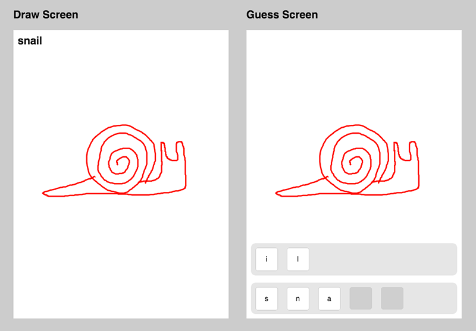

# flipDraw

Collaborative drawing game in JavaScript and Firebase.

When you load the page and select a player role, js appends a firebase id and a player role to the url. You can text the url to a friend and the page will load as the opposite player. The draw player draws the word on the screen and the drawing strokes are relayed to the guess player in svg format through firebase. The guess player can see the strokes appear and uses the letter tiles available to spell out the name of the object being drawn on both screens.  

[Dual screen demo on GitHub](Dual Screen Demo)
